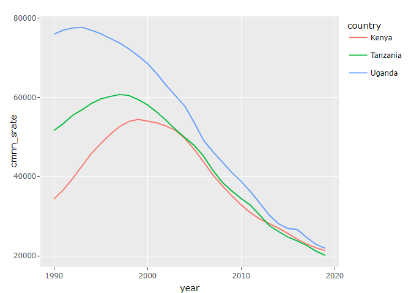

Global Disease Burden Analysis
================
ALPHONSE EGIDIUS OKURUT

# Introduction

This document compares the Disability-Adjusted Life Year (DALY) diseases
burden for three countries: UGANDA, KENYA, and TANZANIA. We compare the
burden due to communicable, maternal, neonatal, and nutritional diseases
(CMNN), non-communicable diseases (NCDs), and overall disease burden for
these countries.

The source data is from the Institute for Health Metrics and Evaluation
(IHME) Global Burden of Disease (GBD) study.

# Communicable, Maternal, Neonatal, and Nutritional Disease Burden (CMNN)

## Table of Estimates for CMNN Burden Over Time

    ## # A tibble: 30 × 4
    ##     year  Kenya Tanzania Uganda
    ##    <dbl>  <dbl>    <dbl>  <dbl>
    ##  1  1990 34322.   51624. 75945.
    ##  2  1991 36630.   53380. 76978.
    ##  3  1992 39510.   55460. 77512.
    ##  4  1993 42581.   56854. 77695.
    ##  5  1994 45822.   58453. 76949.
    ##  6  1995 48346.   59609. 76070.
    ##  7  1996 50629.   60213. 74909.
    ##  8  1997 52614.   60717. 73727.
    ##  9  1998 53894.   60494. 72244.
    ## 10  1999 54448.   59438. 70524.
    ## # ℹ 20 more rows

| year |    Kenya | Tanzania |   Uganda |
|-----:|---------:|---------:|---------:|
| 1990 | 34321.93 | 51624.16 | 75944.97 |
| 1991 | 36629.81 | 53379.70 | 76978.02 |
| 1992 | 39510.43 | 55460.50 | 77511.61 |
| 1993 | 42581.44 | 56854.18 | 77695.11 |
| 1994 | 45822.47 | 58452.76 | 76948.73 |
| 1995 | 48345.59 | 59609.03 | 76070.29 |
| 1996 | 50629.20 | 60212.76 | 74909.36 |
| 1997 | 52614.39 | 60717.00 | 73726.62 |
| 1998 | 53893.87 | 60493.72 | 72243.52 |
| 1999 | 54448.17 | 59437.74 | 70524.46 |
| 2000 | 54031.62 | 58112.20 | 68550.38 |
| 2001 | 53562.06 | 56280.20 | 65942.75 |
| 2002 | 52740.17 | 54165.05 | 63032.73 |
| 2003 | 51644.87 | 51870.74 | 60345.84 |
| 2004 | 49622.21 | 49818.96 | 57778.01 |
| 2005 | 46850.49 | 47862.23 | 53612.07 |
| 2006 | 43667.25 | 45149.29 | 49145.64 |
| 2007 | 40418.84 | 41560.02 | 46258.95 |
| 2008 | 37667.66 | 38556.13 | 43621.19 |
| 2009 | 35177.11 | 36383.30 | 41071.17 |
| 2010 | 32880.90 | 34485.90 | 38831.56 |
| 2011 | 30877.60 | 32753.08 | 36196.78 |
| 2012 | 29278.72 | 30265.72 | 33312.56 |
| 2013 | 28096.14 | 27687.76 | 30292.27 |
| 2014 | 27007.80 | 26129.75 | 28099.68 |
| 2015 | 25610.50 | 24751.08 | 26900.48 |
| 2016 | 24209.18 | 23766.85 | 26645.55 |
| 2017 | 22982.12 | 22638.19 | 24668.12 |
| 2018 | 22034.76 | 21187.60 | 22896.94 |
| 2019 | 21312.06 | 20117.73 | 21904.64 |

## Plot Showing Trends in CMNN Burden Over Time

<!-- -->

## Summary of CMNN Burden Findings

Provide a brief analysis based on the data presented in the table and
chart. Highlight any significant findings or patterns. About 3
sentences.

DALYs for a disease or health condition are the sum of the years of life
lost to due to premature mortality (YLLs) and the years lived with a
disability (YLDs) due to prevalent cases of the disease or health
condition in a population

- According to the plot above, Uganda had slightly more years lost due
  to premature mortality due to the Communicable, Maternal, Neonatal,
  and Nutritional Disease Burden (CMNN) compared to its Kenyan and
  Tanzania counterparts in the East African Community

- Additionaly life years lost have decreased over the years from 1990 to
  2020

- The data also shows that there was a notable disparity in the sum of
  years lost due to CMNN upto about 2005 among the three countries but
  with all countries registering steady decreases in the same and there
  being not notable variations for the next 15 years

# Non-Communicable Disease Burden (NCD)

## Table of Estimates for NCD Burden Over Time

## Plot Showing Trends in NCD Burden Over Time

## Summary of NCD Burden Findings

Provide a brief analysis based on the data presented in the table and
chart. Highlight any significant findings or patterns. About 3
sentences.

# Overall Disease Burden

## Table of Estimates for Overall Disease Burden Over Time

## Plot Showing Trends in Overall Disease Burden Over Time

## Summary of Overall Disease Burden Findings

Provide a brief analysis based on the data presented in the table and
chart. Highlight any significant findings or patterns. About 3
sentences.
